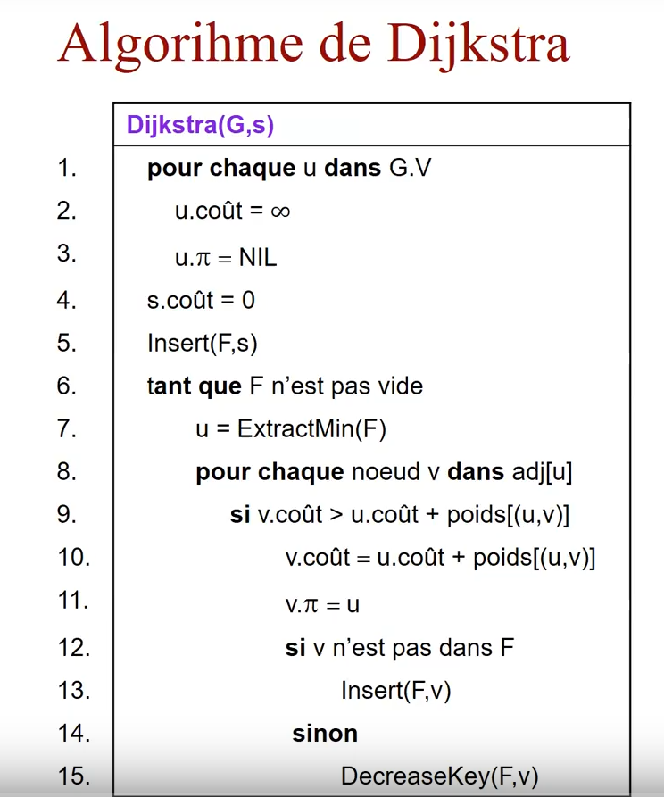
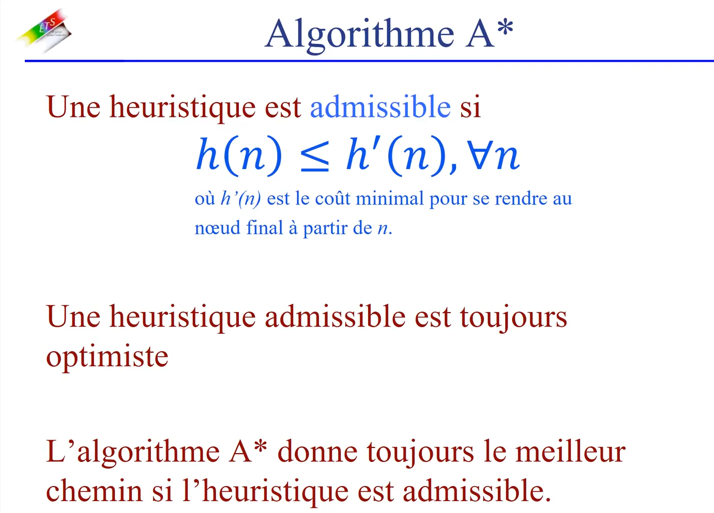

# Recherche dans les graphes

## Recherche du plus court chemin entre 2 noeuds

- meilleur chemin est celui avec la plus petite valeur

### Algo de dijkstra

G est un ensemble de départ

### Algo meilleur en premier

- explore noeud plus proche de la bicble
- utilise une heuristique
  - estimation du cout pour se rendre au noeud final
  - l'heuristique dépend du probl;me
  - les contraintes sont relachées
  - pour les problèmes de types grilles
    - distance de manhatta
    - distance euclidienne

#### Distance de manhattan

- permet les déplacements verticaux et horizontaux
  dst = sqrt( (Xb-Xa)^2 + (Yb-Ya)^2)

### Algo A\*

**Meilleur chemin en premier :** Lors de l'exploration d'un noeud n, les noeuds adhacents sont insérés dans une queue de priorité dont la valeur de la clé est h(n)

**A\* :** Lors de l'exploration d'un noeud n, les noeuds adjacents sont insérés dans une queue de priorité dont la valeur de la clé est :
f(n) = d(n) + h(n)
**ou**

- D(n) eest le cout du meilleur chemin pour se rendre au noeud n à partir du point de départ
- H9m) est l'estimation du cout pour se rendre au noeud final à partir du noeud n

**Cette algo se termine lorsque le noeud recherché est extrait, pas avant**

#### Il est toujours optimal si l'heuristique est optimal

### ALgo minimax

- MAX : le joueur a qui on veut faire gagner la partie. Il va toujours tenter de maximiser son avantage
- MIN : Le joueur adverse, il tente de minim iser l'Avantage du joueur MAX
