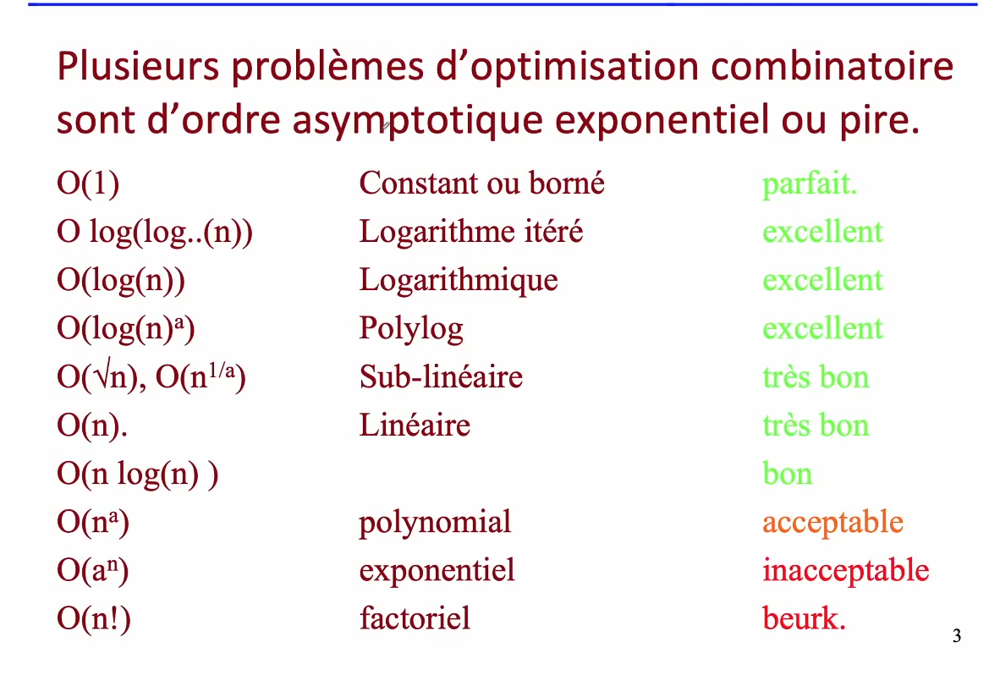

# Cours 9

## Théorie de la complexité

### Problème de décision

un problème de décision est un problème qui a comme sortie oui/non

**La plupart des problèmes d'optimisation combinatoire peuvent être transformés en problème décision**

- même si la résolution est difficile, le vérification de la solution est souvent facile

**Chemin hamiltonien:** chemin qui passe par chacun des noeuds d'un graphe seulement une fois (voyageur de commerce)
**Chamin Euler** chemin parcourant toutes les transistions une seule fois

### Rappel ordre asymptotique

